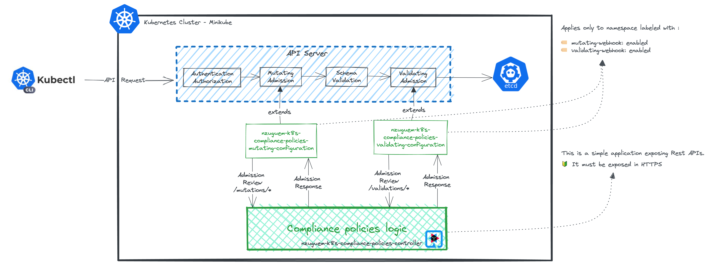

# What is this project ? 🤷🏽‍♂️
One of the problems I encountered when administering Kubernetes clusters shared between several teams was that the manifests that were deployed were not always perfectly mastered.

In some cases, manifests were copied/pasted from other teams, sometimes resulting in little surprises (no label to indicate the team responsible for the application, failure to respect best practices, etc.).

The aim of this project is to take advantage of the extensibility of Kubernetes to set up systems for monitoring compliance and best practices.
Below are the aspects covered by this project: 
- **LATEST container images prohibited**
- **Some resources to be created must contain a "team" label**
- **Some resources must be modified to include labels recommended by kubernetes**

Considerations :
- Organization name: **_nzuguem_**
- Domain : **_nzuguem.me_**
> 🎯 The implicit objective of this project is to understand and implement _kubernetes admission webhooks_.
# Illustration 🖼️


# Launch the project in Dev Mode 🚀

## Prerequisites
- Must have Java 17 + (You can install it via [SDKMan][sdkman-doc])
- Have a local kubernetes cluster (you can use [Minikube][minikube-install])

## Configure the project and kubernetes cluster 🛠️
- Generate certificate for development mode. The **_subjectAltName_** is "_host.minikube.internal_", you can change it as you wish
```bash
make generate-certificate-for-dev
```

- Deploy webhook configuration, who bind on local application in development mode
```bash
make deploy-external-webhook-configuration-for-dev
```

- Create and label the namespace that will contain test resources
```bash
make create-ns-on-minikube-for-test
```

## Run the project 🎬
```bash
make run-local-controller
```
> ❤️ The project is launched in Quarkus dev mode. The main advantage is live reloading without having to do anything.

### Test 🧪
```bash
make dry-run-good-manifest
```

```bash
make dry-run-bad-labels-manifest

# Output
# Error from server (All resources or objects to be created or modified must belong to a team (the <<team>> label is mandatory)): error when creating "src/test/resources/deploy/game-2048-bad-labels.yml": admission webhook "labels-policy.nzuguem.me" denied the request: All resources or objects to be created or modified must belong to a team (the <<team>> label is mandatory)
# Error from server (All resources or objects to be created or modified must belong to a team (the <<team>> label is mandatory)): error when creating "src/test/resources/deploy/game-2048-bad-labels.yml": admission webhook "labels-policy.nzuguem.me" denied the request: All resources or objects to be created or modified must belong to a team (the <<team>> label is mandatory)
# Error from server (All resources or objects to be created or modified must belong to a team (the <<team>> label is mandatory)): error when creating "src/test/resources/deploy/game-2048-bad-labels.yml": admission webhook "labels-policy.nzuguem.me" denied the request: All resources or objects to be created or modified must belong to a team (the <<team>> label is mandatory)

```

```bash
make dry-run-bad-image-manifest

# Output
# Error from server (Container images must not be tagged with <<latest>>): error when creating "src/test/resources/deploy/game-2048-bad-image.yml": admission webhook "image-policy.nzuguem.me" denied the request: Container images must not be tagged with <<latest>>
```

# Deploy the project on cluster kubernetes 🛫

## Configure kubernetes cluster 🛠️
- Generate & Create namespace  and secret for controller on minikube
```bash
make generate-certificate-on-minikube-for-deploy-controller
```

- Deploy the webhook configuration, the one that links to the kubernetes service linked to the controller
```bash
make deploy-internal-webhook-configuration
```
- Create and label the namespace that will contain test resources
```bash
make create-ns-on-minikube-for-test
```
## Build container image 🏗️
```bash
make build-image-generate-manifests-for-deploy-controller
```

> ❤️ The docker image is built for us via the Quarkus _Container-image-docker_ extension (the Dockerfile is also provided by Quarkus in [src/main/docker](src/main/docker)
>
> ❤️ Kubernetes deployment manifests are also generated for us by the Quarkus _Kubernetes_ extension (in [target/kubernetes](target/kubernetes))

## Deploy 🚀
```bash
make deploy-controller-on-minikube
```

To track controller logs :
```bash
make logs-controller-on-minikube
```

# Clean 🧹
```bash
# Undeploy webhook configuration
make undeploy-external-webhook-configuration-for-dev
make undeploy-internal-webhook-configuration

# Undeploy webhook controller
make delete-ns-on-minikube-from-deploy-controller

# Delete namespace for test
make delete-ns-on-minikube-from-test

# Delete docker image of controller
make delete-image-docker-of-controller
```
# Alternatives 🙂
As we can see, Admissions webhooks require you to develop your own Controller, which wasn't very accessible 😓.

Luckily for us, We have several alternatives :
- [Gatekeeper and OPA][gatekeeper-opa-doc]
- [Kyverno][kyverno-doc]
- [Kubernetes Validating Admission Policy][k8s-validating-admission-policy-doc] -> In alpha version since 1.26 and in beta since 1.28. May require activation on the API Server
# Useful links 🔗
- [Quarkus][quarkus-doc]
- [Admission controllers][admission-controllers-doc]
- [Extensible admission controllers][extensible-admission-controllers-doc]

<!-- Links -->
[quarkus-doc]: https://quarkus.io/
[extensible-admission-controllers-doc]: https://kubernetes.io/docs/reference/access-authn-authz/extensible-admission-controllers/
[admission-controllers-doc]: https://kubernetes.io/docs/reference/access-authn-authz/extensible-admission-controllers/
[sdkman-doc]: https://sdkman.io/
[minikube-install]: https://minikube.sigs.k8s.io/docs/start/
[gatekeeper-opa-doc]: https://open-policy-agent.github.io/gatekeeper/website/docs/
[kyverno-doc]: https://kyverno.io/docs/introduction/#quick-start
[k8s-validating-admission-policy-doc]: https://kubernetes.io/docs/reference/access-authn-authz/validating-admission-policy/
